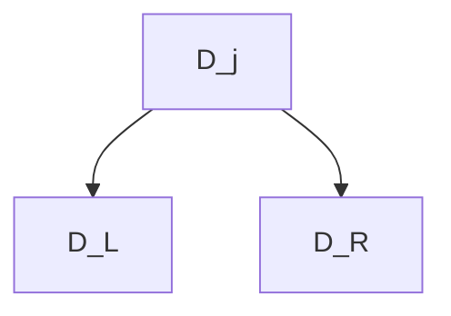

# Information Gain 
#ml/information-theory/information-gain #ml/models/classic/decision-tree/information-gain

`Information Gain` is the amount of uncertainty reduced after the split, as measured by the [[Entropy]].



$$
\text{InfoGain}(D_{j}, t_{j})
= H(D_{j}) - \left( \frac{N_{L}}{N_{j}} H(D_{L}) + \frac{N_{R}}{N_{j}} H(D_{R}) \right)
$$
where
- $D_{j}$ is set of $N_{j}$ data points at node $j$ (feature $j$)
- $D_{L}$ is the set of $N_{L}$ data points split into `left child node`.
- $D_{R}$ is the set of $N_{R}$ data points split into `right child node`.

---
## Example

Consider the following example.

| Color ($C_{1}$) | Shape ($C_{2}$) | Toy ($y$) |
| :-------------- | :-------------- | :-------- |
| 0               | 1               | 0         |
| 1               | 1               | 0         |
| 1               | 1               | 0         |
| 0               | 1               | 0         |
| 0               | 0               | 1         |
| 1               | 0               | 1         |
| 0               | 0               | 1         |
| 0               | 0               | 1         |

When using color($C_{1})$ to partition dataset,
- For `Left Child Node` $(D_{C_{1} = 0})$
	- $P(y = 0 | C_{1} = 0) = \frac{2}{5}$
	- $P(y = 1 | C_{1} = 0) = 1 - \frac{2}{5} = \frac{3}{5}$
	$H(D_{C_{1}=0}) = -[\frac{3}{5}\log\left( \frac{3}{5} \right)  + \frac{2}{5} \log\left( \frac{2}{5} \right)] \approx 0.971$
- For `Right Child Node` $(D_{C_{1} = 1})$
	- $P(y=0 | C_{1} = 1) = \frac{2}{3}$
	- $P(y=1 | C_{1} = 1) = \frac{1}{3}$
	$H(D_{C_{1}=1}) = -[\frac{2}{3}\log\left( \frac{2}{3} \right) + \frac{1}{3} \log\left( \frac{1}{3} \right)] \approx 0.918$
- $D_{y} = - [\frac{1}{2} \log\left( \frac{1}{2} \right) + \frac{1}{2} \log\left( \frac{1}{2} \right) ] = 1$

Computing the information gain, 
$$
\begin{align}
\text{InfoGain}(D_{C_{1}}, t_{C_{1}})  
&= H(D_{y}) - \left( \frac{N_{C_{1}=0}}{N_{C_{1}}} H(D_{C_{1}=0}) + \frac{N_{N_{C_{1}=1}}}{N_{C_{1}}} H(D_{C_{1}=1}) \right) \\[6pt]
&= 1 - \frac{5}{8} \times 0.971 - \frac{3}{8} \times 0.918 \\[6pt]
&\approx 0.0488
\end{align}
$$

Hence, partitioning by Color is not a good split.

---
## Greedy Algorithm

This is a recursive algorithm that grow the tree from node, and build the tree one node at a time.
```python
for each feature 𝑙
	for each threshold 𝜏
		compute InfoGain(D_j, l, t)

Select the split function with max InfoGain

If stopping criteria is met
	stop splitting node
```

where stopping criteria can be
- Depth of tree
- Entropy Threshold
- Minimum number of points in node

---
## See Also
- [[Entropy]]
- [[Decision Tree]]
