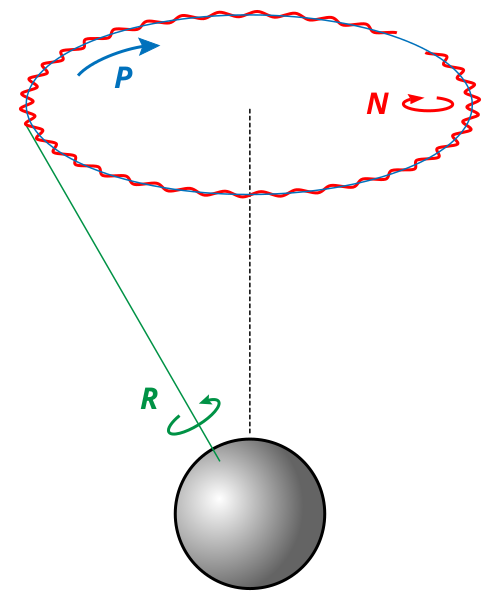
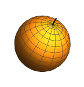

# Euler Rotations
#math #cv #robotics #astronomy 

A special Davenport rotation in which first and third axes are overlapping to each other.

**Euler Rotations**: 
(z-x-z, x-y-x, y-z-y, z-y-z, x-z-x, y-x-y)

A practical example is the z-x-z (3-1-3) used in #robotics and precession-nutation-intrinsic_rotation used in #astronomy

- **Outer Matrix**: Rotation around one of the axes of reference frame.
- **Middle Matrix**: Rotation around intermediate axes called lines of nodes.
- **Inner Matrix**: Rotation around one of the moving frame axes.

## Yaw-Pitch-Yaw (3-2-3)
Used in #satellite and #spacecraft altitude control systems.

Useful when
- yaw isn't well defined
- forward direction is arbitrary

$$
Yaw_{1}(\phi) = R_{z}(\phi) = 
\begin{bmatrix}
\cos(\psi) & -\sin(\psi) & 0 \\
\sin(\psi) & \cos(\psi) & 0 \\
0 & 0 & 1
\end{bmatrix}
$$
$$
Pitch(\phi) = R_{y}(\theta) = 
\begin{bmatrix}
\cos(\theta) & 0 & \sin(\theta) \\
0 & 1 & 0 \\
-\sin(\theta) & 0 & \cos(\theta)
\end{bmatrix}
$$
$$
Yaw_{2}(\phi) = R_{z}(\phi) = 
\begin{bmatrix}
\cos(\psi) & -\sin(\psi) & 0 \\
\sin(\psi) & \cos(\psi) & 0 \\
0 & 0 & 1
\end{bmatrix}
$$

Note that [[Gimbal Lock]] occurs at $\theta = 0$ and $\theta = \pi$

## Yaw-Roll-Yaw (3-1-3)
Used in 
- #robotics to control 3D rigid body orientation.
- #astronomy to represent planetary orientation.

$$
Yaw_{1}(\phi) = R_{z}(\phi) = 
\begin{bmatrix}
\cos(\psi) & -\sin(\psi) & 0 \\
\sin(\psi) & \cos(\psi) & 0 \\
0 & 0 & 1
\end{bmatrix}
$$
$$
Roll(\phi) = R_{x}(\theta) = 
\begin{bmatrix}
1 & 0 & 0 \\
0 & \cos(\phi) & -\sin(\phi) \\
0 & \sin(\phi) & \cos(\phi)
\end{bmatrix}
$$
$$
Yaw_{2}(\phi) = R_{z}(\phi) = 
\begin{bmatrix}
\cos(\psi) & -\sin(\psi) & 0 \\
\sin(\psi) & \cos(\psi) & 0 \\
0 & 0 & 1
\end{bmatrix}
$$

Note that [[Gimbal Lock]] occurs at $\phi = 0$ and $\phi = \pi$

## Precession-Nutation-Intrinsic Rotation
Used to represent planetary orientation.
Typically represented in (3-1-3)

#### Graphical Representation

### Precession 

## Nutation

## Intrinsic Rotation
Normal rotation, but using the local coordinates (ie new coordinate system relative to previous rotations)

## See Also
- [[Davenport Rotation]]
- [[Tait-Bryan Rotation]]
- [[Gimbal Lock]]

## Read Also
- [Wikipedia](https://en.wikipedia.org/wiki/Davenport_chained_rotations#Euler_chained_rotations)
- [Precession Wikipedia](https://en.wikipedia.org/wiki/Precession)
- [Nutation Wikipedia](https://en.wikipedia.org/wiki/Nutation)
- [Intrinsic vs Extrinsic (Blog)](https://dominicplein.medium.com/extrinsic-intrinsic-rotation-do-i-multiply-from-right-or-left-357c38c1abfd)
