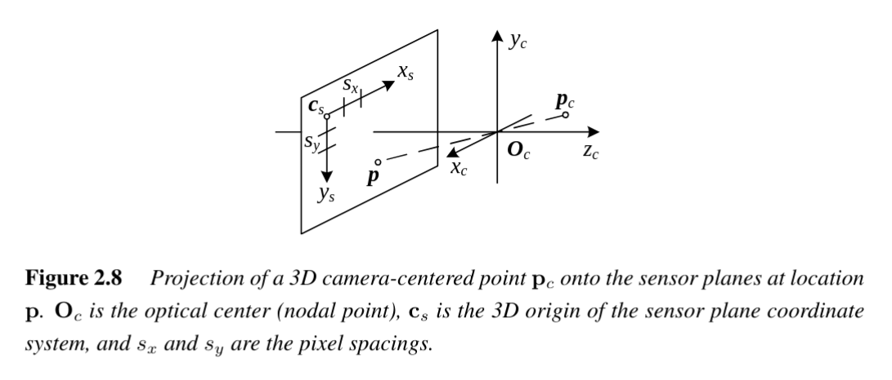

# Camera Extrinsics
 #cv/camera/extrinsics 

Camera **extrinsics** describe the **pose of the camera** in 3D space—i.e., its **orientation** and **position** relative to a chosen world coordinate system. 
While **intrinsics** capture the internal properties of the imaging system, **extrinsics** define how the camera is placed in the external scene.

---

## 1. Definition

Given a 3D point in **world coordinates** $p_w$, the **extrinsic parameters** map this point into the **camera-centered coordinate system** $p_c$:

$$
p_c = R \, p_w + t
$$

- $R \in SO(3)$: a $3 \times 3$ **rotation matrix** describing the camera's orientation.
- $t \in \mathbb{R}^3$: a **translation vector** describing the position of the camera center in the world frame.

Equivalently, in homogeneous coordinates:

$$
p_c =
\begin{bmatrix}
R & t \\
0 & 1
\end{bmatrix}
p_w
$$

This $[R|t]$ block is the **extrinsic matrix**.

---

## 2. Relation to Camera Matrix

The full mapping from 3D world coordinates $p_w$ to 2D pixel coordinates $\tilde{x}_s$ involves both intrinsics ($K$) and extrinsics ($[R|t]$):

$$
\tilde{x}_s = K [R \;|\; t] \, p_w
$$

- $K$: intrinsic calibration matrix (focal length, skew, principal point).
- $[R|t]$: extrinsic matrix (camera pose).

The combined product $P = K [R|t]$ is called the **camera projection matrix**.

---

## 3. Interpreting $R$ and $t$

### Rotation $R$
- Rotates coordinates from **world frame → camera frame**.
- Columns of $R$ are the camera’s **axis directions** expressed in world coordinates:
  - First column: camera’s $x_c$ axis.
  - Second column: camera’s $y_c$ axis.
  - Third column: camera’s $z_c$ axis (optical axis).

### Translation $t$
- Represents the location of the **camera center $O_c$** in the world frame.  
- Important distinction:
  - $t$ is **not the world position of the camera directly**.  
  - Instead, it satisfies:
    $$
    O_c = -R^T t
    $$
    i.e., $t$ encodes the camera’s position relative to the world after rotation.

---

## 4. Degrees of Freedom

- Rotation $R$: **3 DOF** (Euler angles, quaternions, or rotation matrices).  
- Translation $t$: **3 DOF** (x, y, z position).  
- Total: **6 degrees of freedom** (the rigid motion of the camera in 3D).

---

## 5. Visualization

- **World frame**: fixed coordinate system in which scene geometry is defined.
- **Camera frame**: local 3D coordinate system:
  - Origin: camera optical center.
  - $z_c$: optical axis (points forward).
  - $x_c$: horizontal axis (points right).
  - $y_c$: vertical axis (points downward in many CV conventions).

The extrinsic matrix tells us how to transform between these frames.

---

## 6. Practical Notes

- Extrinsics are estimated together with intrinsics during **camera calibration**.  
- Ambiguities exist:
  - The **same image projections** may correspond to multiple combinations of $K$, $R$, and $t$ if not constrained.
- In multi-view geometry:
  - Each camera has its own extrinsic matrix relative to a shared world coordinate system.  
  - By fixing one camera as the **reference frame**, we express all others relative to it.

---

## 7. Summary

- **Camera extrinsics** define *where the camera is* and *how it is oriented* in the world.  
- Represented by a **$3 \times 4$ matrix** $[R|t]$ with **6 DOF**.  
- Used with intrinsics $K$ to form the **camera matrix**:
  $$
  P = K [R|t]
  $$
- Together, intrinsics and extrinsics enable projecting **3D world points → 2D image pixels**.

## See Also
- [[Camera Matrix]]
- [[Camera Intrinsics]]