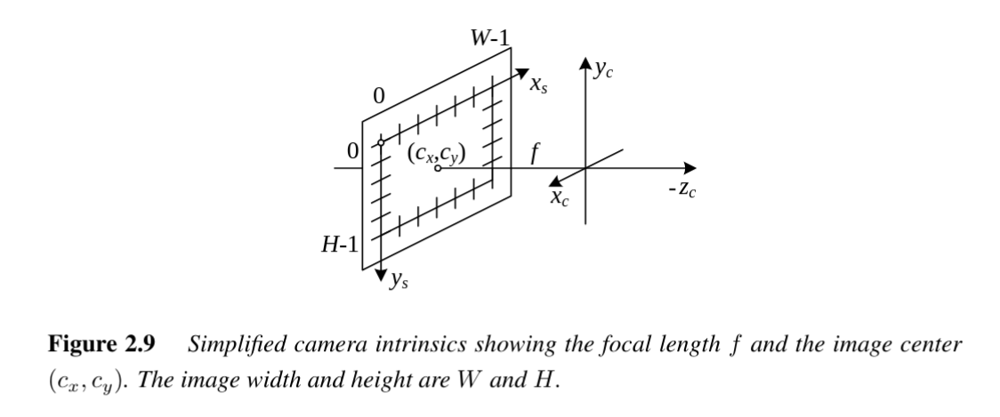

# Camera Intrinsics
 #cv/camera/intrinsics

Camera intrinsics describe the internal parameters of a camera that map **3D camera-centered coordinates** to **2D pixel coordinates**. 
Unlike extrinsics (which capture the camera's orientation and position in the world), intrinsics are properties of the camera itself—its focal length, sensor pixel spacing, skew, and principal point.

---
## 1. From Pixels to 3D Rays

Image sensors provide integer pixel coordinates $(x_s, y_s)$ (top-left corner is typically $(0,0)$). To relate these pixel indices to 3D geometry:

1. **Pixel scaling**: multiply $(x_s, y_s)$ by the pixel spacing $(s_x, s_y)$.
2. **Sensor placement**: define the sensor origin $c_s$ and orientation $R_s$ relative to the camera projection center $O_c$.

This leads to the **sensor homography** $M_s$:

$$
p = M_s \, \bar{x}_s, \quad
M_s =
\begin{bmatrix}
R_s & c_s
\end{bmatrix}
\begin{bmatrix}
s_x & 0 & 0 \\
0 & s_y & 0 \\
0 & 0 & 0 \\
0 & 0 & 1
\end{bmatrix}
\begin{bmatrix}
x_s \\ y_s \\ 1
\end{bmatrix}
$$

- The **first two columns** of $M_s$: 3D vectors for unit steps in $x_s$ and $y_s$.
- The **third column**: 3D location of the image origin $c_s$.

$M_s$ has **7–8 degrees of freedom**:
- $3$ for rotation $R_s$
- $3$ for translation $c_s$
- $2$ for scale factors $(s_x, s_y)$  
(but one degree of freedom is redundant without absolute scale knowledge).

---

## 2. The Calibration Matrix $K$

We relate 3D camera-centered points $p_c$ to pixel coordinates $\tilde{x}_s$:

$$
\tilde{x}_s = K \, p_c
$$

where $K = \alpha M_s^{-1}$ is the **camera intrinsic matrix**.

- $K$ is a $3 \times 3$ homogeneous matrix.
- Theoretically: **7 DOF**  
- In practice: often treated as **8 DOF** (arbitrary $3\times 3$).

---

## 3. Why Upper-Triangular?

When estimating intrinsics from calibration (using known 3D–2D correspondences), the decomposition

$$
\tilde{x}_s = K [R|t] p_w
$$

cannot uniquely determine the "true" sensor orientation and scaling.  
Instead, we conventionally reduce $K$ to an **upper-triangular form** using **QR factorization**.

---

## 4. Common Forms of $K$

### General Form
$$
K =
\begin{bmatrix}
f_x & s & c_x \\
0 & f_y & c_y \\
0 & 0 & 1
\end{bmatrix}
$$

- $f_x, f_y$: focal lengths in pixels (can differ if pixels are rectangular).  
- $s$: skew (non-orthogonal pixel axes, usually negligible $\approx 0$).  
- $(c_x, c_y)$: **principal point** (usually near image center).

---

### Aspect Ratio Explicit
$$
K =
\begin{bmatrix}
fs & c_x \\
0 & af & c_y \\
0 & 0 & 1
\end{bmatrix}
$$

- $f$: common focal length  
- $a$: aspect ratio (accounts for scaling in $y$ vs $x$).

---

### Simplified Practical Form
Often used in computer vision:
$$
K =
\begin{bmatrix}
f & 0 & c_x \\
0 & f & c_y \\
0 & 0 & 1
\end{bmatrix}
$$

- Assume $a=1$, $s=0$, square pixels, no skew.  
- If origin is set at the image center:  
  $(c_x, c_y) \approx (W/2, H/2)$, with $W,H$ the image width and height.

Thus, only **one unknown remains: the focal length $f$.**

---

## 5. Visual Interpretation

- **Focal length $f$**: determines field of view.  
  Relation with horizontal FOV $\theta_H$:
  $$
  f = \frac{W}{2 \, \tan(\theta_H/2)}
  $$

- **Principal point $(c_x, c_y)$**: where the optical axis intersects the image plane.  
- **Skew $s$**: accounts for misaligned axes (rarely used).  
- **Pixel scaling $(s_x, s_y)$**: relates physical sensor spacing to pixel indices.

---

## 6. Summary

- Camera intrinsics $K$ map **3D camera coordinates → 2D pixel coordinates**.  
- $K$ is usually expressed as an **upper-triangular matrix** with 5 parameters:  
  $(f_x, f_y, c_x, c_y, s)$.  
- In practice, simplifications (square pixels, centered principal point, zero skew) reduce calibration to a **single focal length**.  
- Intrinsics must be estimated (camera calibration), since they cannot be measured directly from image data alone.
