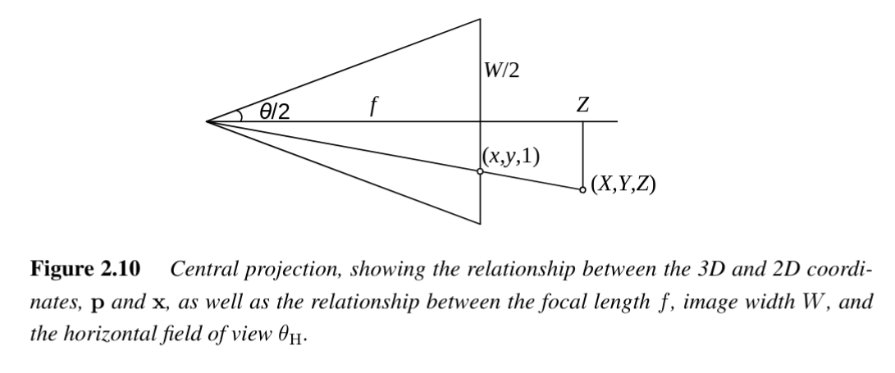

# Focal Length
 #cv/camera/focal-length

Focal length ($f$) is a fundamental parameter of camera intrinsics. 
It describes how strongly the camera lens converges light to form an image and determines the relationship between a 3D scene and its 2D projection. 
However, in computer vision, the expression of focal length can vary depending on the units (millimeters, pixels, or unitless normalized coordinates). 
This often leads to confusion when implementing algorithms or comparing with photography.

---
## 1. Focal Length in Pixels

When image coordinates are measured in **pixels**:

- The **focal length $f$** and **principal point $(c_x, c_y)$** are expressed in pixel units.  
- This is the common form used in the **intrinsic calibration matrix $K$**:

$$
K =
\begin{bmatrix}
f & 0 & c_x \\
0 & f & c_y \\
0 & 0 & 1
\end{bmatrix}
$$

Here, $f$ is scaled relative to the pixel grid.

---
## 2. Relationship to Field of View

Focal length determines the **field of view (FOV)**. For an image width $W$ and horizontal FOV $\theta_H$:

$$
\tan \left(\frac{\theta_H}{2}\right) = \frac{W}{2f}
\quad \Rightarrow \quad
f = \frac{W}{2 \, \tan(\theta_H / 2)}
\tag{2.60}
$$

- Larger $f$: **narrower FOV** (zoomed in).  
- Smaller $f$: **wider FOV** (zoomed out).

[[Normalized Device Coordinates |Here is the reason why we have '2' in the formula]]

---
## 3. Photography vs Computer Vision

- **Photography (film/digital sensors):**  
  $f$ is expressed in **millimeters**, tied to the physical sensor width.  
  Example:  
  - 35mm film → width $W = 36\,$mm.  
  - Standard lenses:  
    - $f=50$mm → "normal" lens.  
    - $f=85$mm → portrait lens.  

- **Computer vision:**  
  It is more convenient to express $f$ in **pixels**, since images are processed in pixel units.  
  Conversion between millimeters and pixels depends on sensor resolution and pixel pitch.

---
## 4. Normalized Device Coordinates (NDC)

Another convention rescales pixel coordinates into **unitless ranges**:

- Define image coordinates:  
  $$
  x'_s = \frac{2x_s - W}{S}, \quad 
  y'_s = \frac{2y_s - H}{S}
  $$
  where $S = \max(W, H)$ and $a = W/H$ is the aspect ratio.

- This rescales the image to $[-1, 1)$ in the longer dimension.  
- Advantage: **focal length and principal point become resolution-independent**, useful in:
  - **Image pyramids** (multi-resolution processing).  
  - **Computer graphics** (e.g., OpenGL normalized device coordinates).

---
## 5. Unitless Representation

With normalization ($S=W=2$), the relationship simplifies:

$$
f^{-1} = \tan \left(\frac{\theta_H}{2}\right)
\tag{2.62}
$$

This yields a **unitless focal length**.  

---
## 6. Conversions Between Representations

- **Unitless $\to$ Pixels:**  
  Multiply by $W/2$.  

- **Pixels $\to$ 35mm-equivalent (mm):**  
  Multiply by 18mm (scaling from half the 36mm film width).  

---
## 7. Summary

- Focal length $f$ links **sensor size**, **field of view**, and **pixel coordinates**.  
- **Photography:** $f$ in mm, tied to physical sensor size.  
- **Computer vision:** $f$ in pixels (intrinsic matrix $K$).  
- **Normalized coordinates:** unitless $f$, independent of resolution.  
- Conversions are straightforward, but **unit choice must always be consistent** with the calibration model.

## See Also
- [[Normalized Device Coordinates]]
- [[Camera Matrix]]