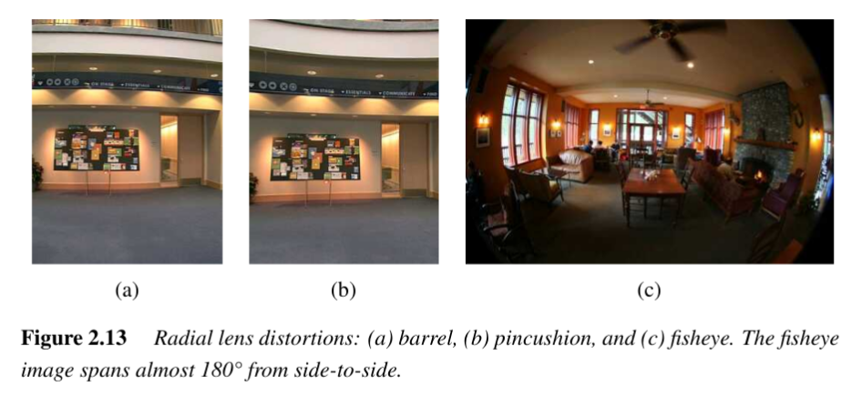

# Fisheye Distortion
 #cv/camera/distortion/fisheye 

Fisheye distortion occurs in lenses with an extremely wide field of view, often approaching or exceeding **180°**. 

Unlike standard radial distortion models (which use low-order polynomials to approximate displacement), fisheye lenses follow a fundamentally different projection geometry. 

They map angles away from the optical axis directly into radial distances on the sensor.

---
## 1. Basic Concept

A fisheye lens does not preserve straight lines. Instead, it projects the world using a nearly spherical mapping, which compresses wide fields of view into a circular or hemispherical image. This effect is why fisheye lenses are used in applications such as:

- Panoramic and 360° cameras (e.g., RICOH THETA).
- Security and surveillance systems.
- Artistic photography.

---
## 2. Mathematical Model

For fisheye lenses, the relationship between the angle $\theta$ (between the optical axis and the incoming ray) and the radial distance $r$ on the image plane is given by:

$$
r = f \, \theta
$$

where:
- $f$ = focal length,
- $\theta$ = angle of incidence of the incoming light ray relative to the optical axis,
- $r$ = radial distance of the projected point on the sensor.

This mapping is known as the **equi-distant projection** or **$f\theta$ model**.

### Characteristics:
- Distances from the center are **proportional to viewing angles**, not to tangent functions (as in perspective projection).
- As $\theta \to 90^\circ$, $r$ grows linearly, enabling nearly full hemispherical coverage.

---
## 3. Variants and Extensions

- **f-theta lenses**:  
  Lenses designed to approximate the $r = f \theta$ mapping. These are popular in panoramic cameras and laser scanning systems.

- **Extended fisheye models** (Xiong & Turkowski, 1997):  
  Introduce quadratic corrections in azimuthal angle $\phi$, allowing more accurate modeling of real-world fisheye lenses.

- **Generalized models**:  
  Instead of closed-form equations, spline-based or parametric models can be used to handle irregularities.

---
## 4. Parameter Estimation

Calibration of fisheye distortion involves estimating:
- The **center of projection** (optical center in pixel coordinates).
- The **scaling factor $s$** relating angles to pixel distances.
- Optional **correction terms** for real lens imperfections.

This is often done using:
- Overlapping fisheye images,
- Direct intensity-based nonlinear optimization (minimizing misalignment),
- Feature correspondences across multiple fisheye views.

---
## 5. Differences from Radial Distortion

- **Radial distortion**:  
  Uses polynomial terms ($\kappa_1, \kappa_2$) to model deviations of a mostly linear projection.  
  Typical in wide-angle and telephoto lenses.

- **Fisheye distortion**:  
  Fundamentally different projection model ($r = f \theta$).  
  Straight lines cannot be preserved even theoretically, because the mapping is **spherical** rather than projective.

---
## 6. Applications

- **Virtual reality** and **immersive 360° content**.
- **Robotics and autonomous navigation**, where wide coverage is crucial.
- **Astronomy and sky imaging**, where hemispherical coverage is needed.
- **Optical metrology**, where fisheye distortion must be modeled precisely to measure angles.

---
## 7. Summary

Fisheye distortion arises from a fundamentally different lens projection model. Instead of modeling small deviations from a linear projection, fisheye models directly relate **viewing angle** to **radial image distance**. The most common form is the **$f\theta$ model**, but practical implementations often require corrections or parametric calibration.  

While fisheye lenses enable extremely wide-angle imaging, their geometric distortions require careful calibration for use in computer vision and photogrammetry.

---
**Next Pages**:  
- [[Radial Distortion]]  
- [[Spline Distortion]]
- [[Tangential Distortion]]
- [[Non-Central Projections]]
