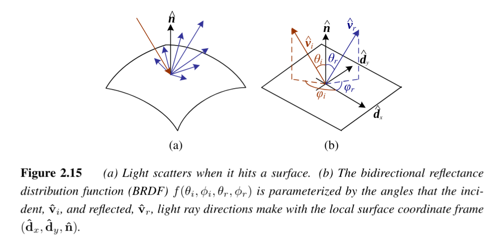

# Bidirectional Reflectance Distribution Function (BRDF)


## Description
The **Bidirectional Reflectance Distribution Function (BRDF)** is the most general and widely used model of **light scattering** at a surface. It defines how much of the incoming light from a given direction is reflected into another direction, depending on the surface’s material properties.  

Formally, the BRDF is a **4D function** defined relative to the local surface frame:

$$
f_r(\theta_i, \phi_i, \theta_r, \phi_r; \lambda)
$$

where  

- $(\theta_i, \phi_i)$ : Incident light direction (angles)  
  - $\theta_i$: **incident zenith angle** (tilt away from surface normal, $0$ = straight above, $90^\circ$ = grazing).  
  - $\phi_i$: **incident azimuth angle** (rotation around the surface normal, like a compass direction in the tangent plane).  

- $(\theta_r, \phi_r)$ : Reflected light direction (angles)  
  - $\theta_r$: **reflected zenith angle** (tilt of outgoing direction relative to normal).  
  - $\phi_r$: **reflected azimuth angle** (rotation of outgoing direction around the normal).  

- $\lambda$ : Wavelength of light. 

---

## Properties
- **Reciprocity**: BRDF is reciprocal under interchange of incident and reflected directions:  
  $$
  f_r(\hat{v}_i, \hat{v}_r, \hat{n}; \lambda) = f_r(\hat{v}_r, \hat{v}_i, \hat{n}; \lambda)
  $$  
  (Also known as *Helmholtz reciprocity*).  

- **Isotropy vs. Anisotropy**:  
  - *Isotropic surfaces* have no preferred orientation → BRDF depends only on angles relative to the surface normal.  
  - *Anisotropic surfaces* (e.g., brushed aluminum) exhibit directional dependence due to surface structure.  

For isotropic materials, the BRDF simplifies to:  

$$
f_r(\theta_i, \theta_r, |\phi_r - \phi_i|; \lambda) \quad \text{or} \quad f_r(\hat{v}_i, \hat{v}_r, \hat{n}; \lambda)
$$  
---
## Radiance Equation
The outgoing radiance in direction $\hat{v}_r$ is obtained by integrating the incoming light weighted by the BRDF and the cosine foreshortening factor:

$$
L_r(\hat{v}_r; \lambda) = \int L_i(\hat{v}_i; \lambda) f_r(\hat{v}_i, \hat{v}_r, \hat{n}; \lambda) \cos^+ \theta_i \, d\hat{v}_i
$$

where  

- $L_r(\hat{v}_r; \lambda)$ : Outgoing radiance  
- $L_i(\hat{v}_i; \lambda)$ : Incoming radiance from direction $\hat{v}_i$  
- $\cos^+ \theta_i = \max(0, \cos \theta_i)$ : Foreshortening factor  

If light sources are discrete (e.g., point lights), the integral simplifies to a summation:

$$
L_r(\hat{v}_r; \lambda) = \sum_i L_i(\lambda) f_r(\hat{v}_i, \hat{v}_r, \hat{n}; \lambda) \cos^+ \theta_i
$$  

---

## Modeling Approaches
BRDFs for real-world materials can be obtained through:  

1. **Physical modeling**  
   - Torrance & Sparrow (1967)  
   - Cook & Torrance (1982)  

2. **Heuristic modeling**  
   - Phong (1975)  
   - Lafortune et al. (1997)  

3. **Empirical measurement**  
   - Ward (1992), Westin et al. (1992)  
   - Dana et al. (1999), Marschner et al. (2000)  
   - Matusik et al. (2003), Weyrich et al. (2009), Shi et al. (2019)  

---
## Components
Typical BRDFs are often split into **diffuse** and **specular** components:  
- [[Diffuse Reflection]] (Lambertian scattering)  
- [[Specular Reflection]] (mirror-like/glossy scattering)  

---
## Diagram (Conceptual)
```
Incident Light (vi)
        ↘
         ↘ θi
          ↘       Surface Normal (n)
           *------↑
          /       |
         / θr     |
Reflected Light (vr)
```

---
## Applications
- Foundation of **physically based rendering (PBR)**.  
- Used to model realistic shading and material appearance.  
- Essential in graphics, vision, and optics for describing surface reflectance.  

---

## Links
- [[Diffuse Reflection]]  
- [[Specular Reflection]]  
- [[Lambert's Cosine Law]]  
- [[Lighting Models]]  
- [[Reflectance & Shading]]
