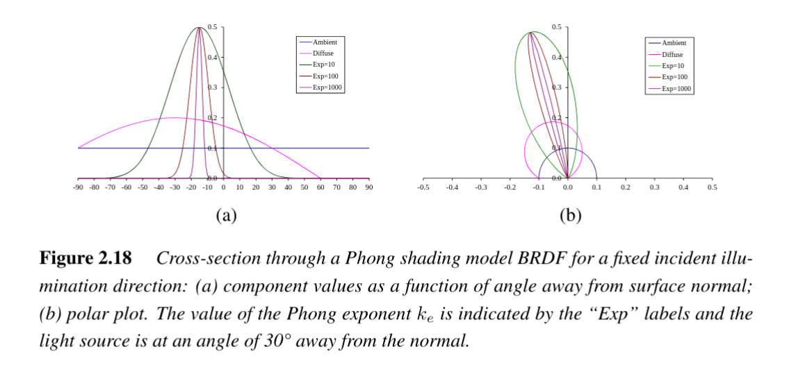

# Phong Shading Model


## Description
The **Phong shading model** (Phong, 1975) is a classic empirical model in computer graphics that combines three components of reflection:  

1. **Ambient reflection** – accounts for indirect and global illumination (e.g., inter-reflections from walls, sky light).  
2. **Diffuse reflection** – Lambertian scattering based on the angle between incident light and surface normal.  
3. **Specular reflection** – highlights caused by mirror-like reflection around the surface normal.  

Although no longer the most physically accurate, it has been highly influential in computer graphics and was widely used in early graphics hardware before being superseded by physically based models (e.g., Cook–Torrance).

---
## Ambient Component
The ambient term models the **general background illumination** present in most scenes:

$$
f_a(\lambda) = k_a(\lambda)L_a(\lambda)
$$

where  
- $k_a(\lambda)$ : Ambient reflectance of the material  
- $L_a(\lambda)$ : Ambient illumination spectrum  

This term is independent of surface orientation.

---
## Full Phong Shading Equation
Combining ambient, diffuse, and specular components:

$$
L_r(\hat{v}_r; \lambda) =
k_a(\lambda)L_a(\lambda) +
k_d(\lambda) \sum_i L_i(\lambda)[\hat{v}_i \cdot \hat{n}]_+ +
k_s(\lambda) \sum_i L_i(\lambda)(\hat{v}_r \cdot \hat{s}_i)^{k_e}
$$

where  
- $L_r(\hat{v}_r; \lambda)$ : Outgoing radiance in view direction $\hat{v}_r$  
- $k_d(\lambda)$ : Diffuse reflectance coefficient  
- $k_s(\lambda)$ : Specular reflectance coefficient  
- $\hat{v}_i$ : Incident light direction  
- $\hat{n}$ : Surface normal  
- $\hat{s}_i$ : Ideal specular reflection direction  
- $k_e$ : Phong exponent (shininess factor)  
- $[\hat{v}_i \cdot \hat{n}]_+ = \max(0, \hat{v}_i \cdot \hat{n})$ : Foreshortening factor  

---
## Component Behavior
- **Ambient**: Uniform across the surface; captures environment light (often tinted blue outdoors or yellow indoors).  
- **Diffuse**: Depends on angle between $\hat{v}_i$ and $\hat{n}$ (Lambert’s cosine law).  
- **Specular**: Depends on alignment between $\hat{v}_r$ and $\hat{s}_i$; sharpness controlled by exponent $k_e$.  

### Specular exponent $k_e$:
- Large $k_e$ → sharp, narrow highlights (glossy, polished surfaces).  
- Small $k_e$ → wide, soft highlights (dull surfaces).  

---
## Material Properties
- $k_a(\lambda)$ and $k_d(\lambda)$ are often similar (both caused by **subsurface scattering**).  
- $k_s(\lambda)$ is often white (wavelength-independent), since interface reflections typically preserve light color.  
  - **Dielectrics** (plastics, ceramics): white specular.  
  - **Metals** (copper, gold): colored specular highlights.  

---
## Visual Intuition
- Shadows often appear **bluer** outdoors due to blue skylight providing the ambient term.  
- Lit regions are dominated by the direct light source, while shaded areas depend on $L_a(\lambda)$.  

---
## Diagram (Conceptual)
```
   Light Source
       \
        \ θi
         \
          *----↑ n (normal)
         /     |
        / θs   |
Viewer --------→ vr

Components:
- Ambient = constant background
- Diffuse ∝ cos(θi)
- Specular ∝ (vr · si)^ke
```

---

## Limitations
- Empirical, not physically accurate.  
- Does not conserve energy in all cases.  
- Replaced by microfacet-based models such as [[Cook–Torrance Model]].  

---
## Links
- [[Diffuse Reflection]]  
- [[Specular Reflection]]  
- [[Lambert's Cosine Law]]  
- [[BRDF]]  
- [[Lighting Models]]  
