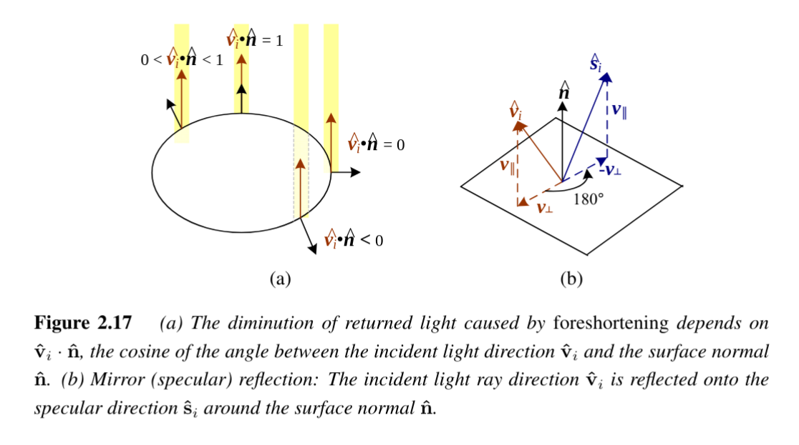

# Specular Reflection


## Description
Specular reflection (also called **gloss** or **highlight reflection**) is the second major component of a typical BRDF. Unlike diffuse reflection, it depends strongly on the **outgoing light direction**. This phenomenon is commonly observed on shiny surfaces such as mirrors, polished metal, or glossy plastic.

Incident light rays reflect in a direction that is the **mirror image** of the incident vector about the surface normal. This results in **specular highlights**, which vary in sharpness depending on the material’s properties.

---

## Reflection Direction
The reflection direction $\hat{s}_i$ can be computed as:

$$
\hat{s}_i = v_{\parallel} - v_{\perp} = (2 \hat{n}\hat{n}^T - I)\hat{v}_i
$$

where  

- $\hat{v}_i$ : Incident light direction  
- $\hat{n}$ : Surface normal  
- $I$ : Identity matrix  

This ensures that light reflects **symmetrically** around the surface normal.

---

## Angular Dependence
The amount of reflected light depends on the angle between the **view direction** $\hat{v}_r$ and the **specular direction** $\hat{s}_i$:

$$
\theta_s = \cos^{-1}(\hat{v}_r \cdot \hat{s}_i)
$$

- $\theta_s = 0$ : Perfect alignment (maximum highlight)  
- Larger $\theta_s$ : Reflection intensity falls off  

---

## Models of Specular Reflection

### 1. Phong Model (1975)
A classic empirical model that uses a cosine falloff:

$$
f_s(\theta_s; \lambda) = k_s(\lambda) \cos^{k_e}(\theta_s)
$$

- $k_s(\lambda)$ : Specular reflectance (wavelength-dependent)  
- $k_e$ : Shininess exponent (controls highlight sharpness)  
  - Large $k_e$ → narrow, sharp highlights (glossy surfaces)  
  - Small $k_e$ → wide, soft highlights (dull surfaces)  

---

### 2. Torrance–Sparrow Microfacet Model (1967)
A physically motivated model that represents surfaces as a collection of **microfacets**, each acting like a tiny mirror. It uses a Gaussian distribution:

$$
f_s(\theta_s; \lambda) = k_s(\lambda) \exp(-c_s^2 \theta_s^2)
$$

- $c_s$ : Inverse width of the Gaussian (controls sharpness)  
- Larger $c_s$ → narrower, more distinct highlights  
- Smaller $c_s$ → softer, spread-out highlights  

---

## Visual Intuition
- **Mirror-like materials**: Very sharp specular reflection, almost no spread.  
- **Plastic, polished wood**: Medium-sized glossy highlights.  
- **Matte surfaces**: Little or no specular reflection, dominated by diffuse.  

---

## Diagram
```
Incident light (vi)       Specular reflection (si)
        \                 /
         \               /
          \   n ↑       /
           \   |       /
            \  |      /
             \ |     /
              \|    /
          -----+---/---- Surface
               |
        View direction (vr)

Specular highlight intensity ∝ alignment of vr with si
```

---

## Applications
- Essential for realistic rendering of shiny and glossy materials.  
- Basis for shading models (Phong, Blinn–Phong, Cook–Torrance, etc.).  
- Used in physically based rendering (PBR) for **specular maps**.  

---

## Links
- [[BRDF]]  
- [[Phong Shading Model]]
- [[Diffuse Reflection]]  
- [[Reflectance & Shading]]
- [[Lighting Models]]  
