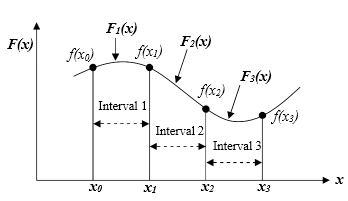

# Piecewise Interpolation

`Piecewise Interpolation` is splitting the domain into small intervals, and [[Polynomial Interpolation|interpolating with low-degree polynomials]] on each interval.

---
`Piecewise Interpolation`

Suppose you have a set of points
$$
(x_{0}, y_{0}), \ (x_{1}, y_{1}), \ \dots, 
\ (x_{n}, y_{n})
$$
Then, we can define a function $S(x)$ as
$$
S(x) = \begin{cases}
p_{0}(x), & x \in [x_{0}, x_{1}]  \\[6pt]
p_{1}(x), & x \in [x_{1}, x_{2}]  \\[6pt]
\vdots \\[6pt]
p_{n-1}(x), & x\in [x_{n-1},x_{n}]
\end{cases}
$$

where for every interval $[x_{i}, x_{i+1}]$,
$$
p_{i}(x_{i}) = y_{i} \ , 
\quad p_{i}(x_{i+1}) = y_{i+1}
$$

---
`Smoothness Conditions`
For `cubic splines`, you additionally require
$$
\begin{align}
p_{i}'(x_{i+1}) &= p_{i+1}'(x_{i+1})  
& (\text{first derivative}) \\[6pt]
p_{i}''(x_{i+1}) &= p_{i+1}''(x_{i+1}) 
& (\text{second derivative}) \\[6pt]
\end{align}
$$

and boundary conditions
$$
\begin{align}
S''(x_{0}) &= 0 \\[6pt]
S''(x_{n}) &= 0
\end{align}
$$

---
## See More
- [[Polynomial Interpolation]]
- [[Runge's Phenomenon]]