# Propositional Logic

`Proposition`: a `True`/`False` statement
Eg: 
- $P$: Nick is a nice guy
- $Q$: Everyone likes B36 (nopeeee)

We can add connectives to make more complex `propositions`.

- `Not`: $\lnot P$
- `And`: $P \land Q$
- `Or`: $P \lor Q$
- `Conditional`: $P \to Q$ (if $P$, then $Q$)
- `Bi-Conditional`: $P \leftrightarrow Q$ ($P \ \text{ iff } \ Q$)

---
## Propositional Variables

`PV`: Set of all propositional variables.

Define the set of all propositional formula.
Let $F$ be the smallest set s.t.
`Basis`: For every $x \in PV$, $x \in F$
`Induction Step`: If $P_{1}, P_{2} \in F$, then 
$\lnot P_{1}, (P_{1} \land P_{2}), (P_{1} \lor P_{2}), (P_{1} \to P_{2}), (P_{1} \leftrightarrow P-2) \in F$

---
## Truth Assignment (t.a.)
$$
\tau: PV \to \{ 0, 1 \}
$$
where
- $0$ is the `False` value
- $1$ is the `True` value

## Extended Truth Assighment 
$$
\tau^*: F \to \{ 0, 1 \}
$$

- $\tau^*(x) = \tau(x)$
- $\tau^*(\lnot P_{1}) = 1- t^*(P_{1})$
- $\tau^*(P_{1} \land P_{2}) = min(\tau^*(P_{1}), \ \tau^*(P_{2}))$
- $\tau^*(P_{1} \lor P_{2}) = max(\tau^*(P_{1}), \ \tau^*(P_{2}))$
- $\tau^*(P_{1} \to P_{2}) = \begin{cases} 1, & \text{if } \tau^*(P_{1}) = 0 \text{ or } \tau^*(P_{2})=1 \\ 0, & \text{otherwise} \end{cases}$
- $\tau^*(P_{1} \leftrightarrow P_{2}) = \begin{cases} 1, & \text{if } \tau^*(P_{1}) = \tau^*(P_{2}) \\ 0, & \text{otherwise} \end{cases}$

---
##  Parse Tree
`Question`
Let $F = (\ (x \leftrightarrow y) \lor \lnot(x \to z) \ )$

`Diagram`

```mermaid
graph TB
    V["OR (V)"] --> B["↔"]
    B --> x
    B --> y
    V --> NOT
    NOT --> C["->"]
	C --> D["x"]
	C --> z
```

`Truth Table`

![[Truth Table Example-1.png]]

---
## Conventions
- omit outermost paranthesis
- `precedence` (high to low)
	- $\lnot$
	- $\land$
	- $\lor$
	- $\to$, $\leftrightarrow$
- With equal precedence, we right associate.
  $x \to y \leftrightarrow z$ is equal to $(x \to (y \leftrightarrow z))$
  $x \land y \land z$ is equal to $(x \land (y \land z))$

---
`Setup`
Let $F$ be a formula
Let $\tau$ be a t.a.
$\tau$ `satisfies` $F$: $\tau^*(F) = 1$
$\tau$ `falsifies` $F$: $\tau^*(F) = 0$

`Defn`
- $F$ is a `tautology` means every t.a. satisfies $F$ ($X \lor \lnot X$)
  Alternatively, you can use $F$ is a `valid formula`.
- $F$ is `satisfiable` means some t.a. `satisfies` $F$
- $F$ is `unsatisfiable` means every t.a. `falsifies`$F$ ($X \land \lnot X$)
  This is a `contradiction`.
- $F$ is `flasifiable` means some t.a. `falsifies` $F$

`More Defn`
Let $F_{1}$, $F_{2}$ be formulas.

- $F_{1}$ `logically implies` $F_{2}$ 
  It means every t.a. that satisfies $F_{1}$, also satisfies $F_{2}$
  Note that contradiction is vacuously true for all t.a.
- $F_{1}$ is `logically equivalent` to $F_{2}$
  It means $F_{1}$ logically implies $F_{2}$ and $F_{2}$ logically implies $F_{1}$
  Notation: $F_{1}$ LEQV $F_{2}$

`Theorem` (no need to proof)
$F_{1} \iff F_{2}$ $\text{iff}$ $F_{1} \leftrightarrow F_{2}$ is a `tautology`.

- $F_{1} \iff F_{2}$  notates the relation 
- $F_{1} \leftrightarrow F_{2}$ defines the new relation

---
## Logical Equivalences
- $P \to Q$ $\implies$ $\lnot P \lor Q$
- $P \leftrightarrow Q$ $\implies$ $P \land Q \lor \lnot P \land \lnot Q$